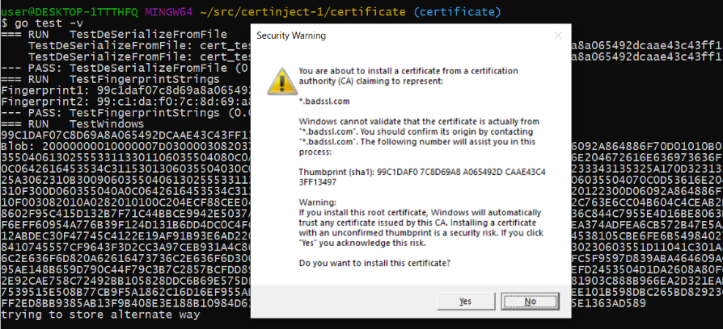
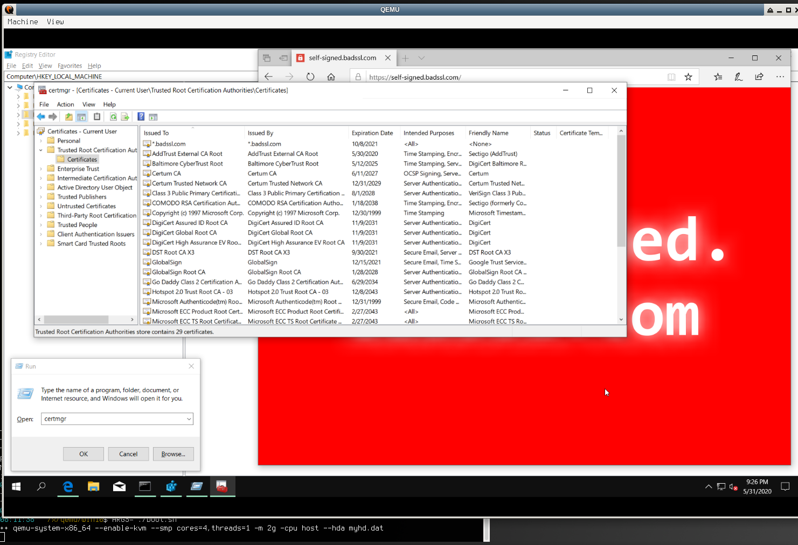
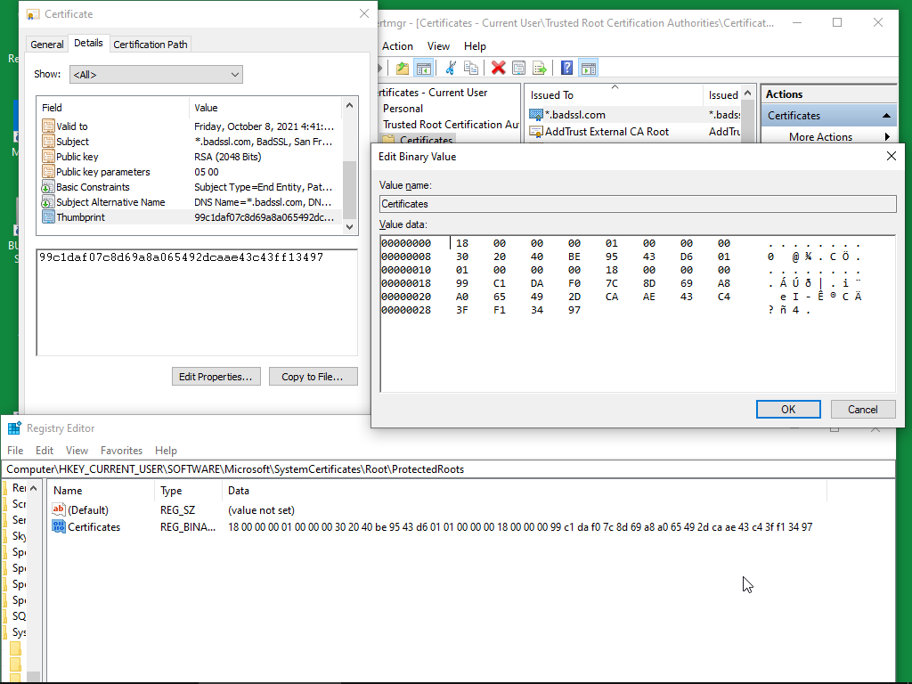

# Namecoin PKI


# Screenshots
### Using syscalls, trusting a certificate creates a popup




### The certmgr command shows that our certificate injection is working good


### Using certmgr to **add** a certificate, a ProtectedRoots key is created/updated


### Using 

## First Bytes

Each encoded blob starts with a special byte (at offset 0) which determines the type of entry.

Here is a list of a few discovered ones:

  * Added with certinject1: `0x20` KEY_IDENTIFIER A 20-byte array containing the SHA-1 hash of the certificate subject public key.
  * Added with certmgr: `0x03000000, 0x01000000, 0x14000000, [sha1 hash], 0x5c000000, 0x01000000, 0x04000000 0x0080000`

## Info

  * Adding a certificate with certmgr inserts the registry keys appropriately.
  * Deleting a certificate from certmgr removes the registry keys appropriately.
  * Certificates appear after successfully injecting a registry key
  * Certificates disappear after removing a registry key
  * To successfully inject a certificate as registry key, conditions must be met.

### Certificate as Registry Key

  * No idea how accurate this may be, as it is pretty much uncharted territory at this point.
  * Some rules may apply to certain stores only.

## References

[Certificate BLOB Properties](https://web.archive.org/web/20200615211614/https://docs.microsoft.com/en-us/openspecs/windows_protocols/ms-gpef/e051aba9-c9df-4f82-a42a-c13012c9d381)

[Common Windows Structures](https://web.archive.org/web/20200615205132/https://docs.microsoft.com/en-us/openspecs/windows_protocols/ms-wcce/a2d33e71-31d9-4934-a369-07ed8c502ae5)

[[MS-CRTD]: Certificate Templates Structure](https://web.archive.org/web/20200615205137/https://docs.microsoft.com/en-us/openspecs/windows_protocols/ms-crtd/4c6950e4-1dc2-4ae3-98c3-b8919bb73822)

[Microsoft Certificate Encoding](https://web.archive.org/web/20200615205141/https://docs.microsoft.com/en-us/openspecs/windows_protocols/ms-bpau/c8ff3449-6fee-4a25-bdb5-a504ce56bb9e)

[Typical Encoded Certificate from Vista](https://web.archive.org/web/20200615205144/https://docs.microsoft.com/en-us/openspecs/windows_protocols/ms-bpau/a4b1d1b7-5a90-4407-ac0a-cf69d281e2ec)

[Certificate Properties](https://web.archive.org/web/20200615205147/https://docs.microsoft.com/en-us/openspecs/windows_protocols/ms-bpau/d9c85e58-a4fa-4f96-ab3e-3cb88a52546b)


### Example Certificate

The example self-signed certificate is the one found here: https://selfsigned.badssl.com/

It expires on Friday, October 8, 2021 at 11:41:52 PM.

SHA256 Fingerprint:
```
1D E4 07 4B 4E 38 37 7F 43 67 30 3F 4A 19 C9 86
A5 06 18 0F 22 A6 E5 3A 68 CC 76 79 EA 6D 9C 74
```

Since we don't control this certificate, at some point it will expire and we will have to patch this test.

Anyways, the test certificate works for now, and is generally accessible.
